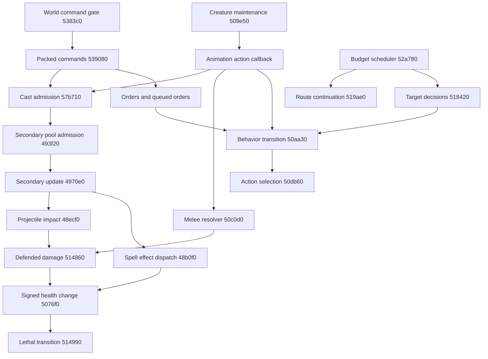

# Original creature AI, combat and spells (No-CD build)

Reviewed 2026-10-04. This is the initial static map of the largest remaining
gameplay workstream: command delivery, creature behavior/actions, autonomous
targeting, damage and spell execution. It connects the recovered
[world tick](world-tick-loop.md), [entity lifetimes](entity-lifetimes.md) and
[movement reconstruction](../../reconstruction/pathfinding/README.md).
The executable still owns these systems. No native simulation, observation hook,
live equivalence test or gameplay balance change is introduced here.

## Evidence and reproduction

Input is `working/game-nocd/Chaos.exe`, PE32/i386, preferred base `0x00400000`,
SHA-256 `40209ca76705b5db04ea1974543bdec1739c68acdebdbefe2537ed025b8b7168`.
Addresses below are preferred-image VAs for this build, not stable host pointers.
Method: bounded Intel disassembly, direct references and read-only Ghidra 12.1.4
pseudocode. Names are descriptive labels; they are not recovered source symbols.

**High confidence** denotes explicit branches, field accesses, calls or dispatch
constants. **Medium confidence** denotes an inferred gameplay meaning supported
by those operations. Unnamed status fields and unreviewed branches remain open.
Decompiler prototypes frequently omit `ECX` receivers or arguments. Assembly is
the authority for calling conventions, packed fields and arithmetic.

```bash
./tools/original-manifest.sh verify
python3 tools/export-creature-behavior.py
./tools/original-manifest.sh verify
```

The hash-checked exporter creates a fresh `working/decompiled/creature-behavior-*`
directory with 60 assembly ranges, direct call/jump contexts, instruction anchors
and artifact hashes, and rechecks that its input is unchanged. Direct textual
references do not enumerate indirect callbacks; inline tables can be decoded as
instructions by objdump. The complete dispatch maps below also require review of
the resolver instructions, rather than relying on the direct-reference list.

For optional pseudocode, use the existing analyzed No-CD Ghidra project with
`-process Chaos.exe -readOnly -noanalysis -scriptPath tools/ghidra -postScript
ExportCreatureBehavior.java OUTPUT_DIRECTORY ENTRY_HEX ...`. Pass entries from
the assembly manifest (without `0x`). The output directory must be new. The script
rejects other program hashes and defines previously missed callback functions
only in the disposable, read-only session. Pseudocode is inferred evidence,
not compilable original source or a replacement model.

Validation on the review date: the exporter produced 60 nonempty ranges and all
artifact hashes matched its manifest; an unsupported input was rejected before
disassembly. The tracked Ghidra script successfully exported the behavior resolver,
ranged event handler and packed cast decoder in a read-only project. Documentation
links and all 104 inventory rows were checked. Original-manifest verification
passed before and after research for 2,927 immutable files. These checks establish
reproducibility and input preservation, not live behavioral equivalence.

## Execution and dependency map



The normal world path delivers commands **before** incrementing the world tick
and before creature maintenance. `0x005383c0` can refuse progress; its network
branch polls, orders and validates command delivery, with replay/nonnetwork paths
also reaching `0x00539080`. This is a simulation synchronization dependency.

Maintenance `0x00509e50` handles timers, ongoing damage and expiry, then invokes
the creature's action callback (`0x0050a8b7`, adjusted receiver from `+0x604`).
Budget scheduler `0x0052a780` follows maintenance. Its continuation cursor services
`0x00519ae0` with a shared route budget (normally 53, conditionally zero). Its
20-phase pass selects active, living slots where `slot % 20 == phase`, calling
`0x00522ad0`, `0x00518420`, then `0x005244f0` in that order. A separate 90-phase,
nonnetwork-only path conditionally calls `0x00523470` for qualifying owners.
These are staggered **update phases**, not measured frequencies in Hz.

The environment pass `0x0052a9f0` can change health based on vertical/type/terrain
conditions; its complete environmental semantics remain unresolved. Secondary
missile/effect updates `0x004970e0` follow the creature passes. Thus melee damage
and later projectile/effect damage occur at different positions in the same world
update. Alternate-world flags skip some normal creature work; see the tick map.
Do not collapse these passes into one generic per-entity update.

Shared dependencies include the global RNG (`0x0054e200`), diplomacy/owner state,
terrain and occupancy, visibility-like eligibility fields, route caches, animation
events, creature/spell configuration, secondary pool capacity and entity lifetime
repair. Slot iteration order, command order, RNG draw order, and effect admission
failure can all affect behavior. Determinism has not been demonstrated live.

## Creature fields used by this workstream

Offsets are byte offsets in the packed `0xe4b` creature record. Unaligned fields
must not become a shared host C++ layout.

| Offset | Recovered role / evidence | Confidence |
| --- | --- | --- |
| `+0`, `+4`, `+0xe4` | Slot index, active flag, current health; health zero does not release a slot | High |
| `+8/+0xc/+0x10`, `+0x14/+0x18/+0x1c` | Tile and finer position coordinates | High |
| `+0xa8/+0xac` | Creature type index / configuration pointer; type records stride `0x5c9` | High |
| `+0x174`, `+0x24 + owner*4` | Owner; per-owner target eligibility (visibility interpretation provisional) | High / Medium |
| `+0x5ec/+0x5f0` | Behavior enum / deferred behavior | High |
| `+0x5f4/+0x5f8` | Behavior code pointer / receiver adjustment | High |
| `+0x5fc`, `+0x600/+0x604` | Action enum, action code pointer / receiver adjustment | High |
| `+0x618`, `+0x66c` | Motion/transition gate; action/planning cooldown | High / Medium |
| `+0x64c/+0x6a8` | Main and alternate creature target indices | High |
| `+0x664/+0x668` | Engagement flag / incoming engagement count | High |
| `+0x680`, `+0x684`, `+0x688`, `+0x698` | Encoded target history; autonomous substate; pending route phase; command mode | High / Medium |
| `+0x570`, `+0x61c` | First attack/spell ID slot; selected embedded cast descriptor | High |
| `+0x62c/+0x630/+0x634`, `+0x638/+0x63c` | Cast aim XYZ, source index, target index | High |
| `+0x160/+0x164` | Ranged readiness deadline / associated gate | High / Medium |
| `+0x96b/+0x96f/+0x973` | Movement destination XYZ | High |
| `+0xbc3/+0xbc7/+0xbcb` | Home/reference XYZ used by targeting and return behavior | Medium |
| `+0x8f9/+0x8fd`, `+0x901/+0x902` | Owned order list / cursor; byte queue fields | High / Medium |
| `+0x906` | Follow/reference target, `-1` clears it | High / Medium |
| `+0x8d5/+0x8d9/+0x8dd` | Ongoing damage count, next deadline, owner attribution | High |
| `+0x90/+0x94/+0xa0/+0x81d/+0x8c5` | Mitigation, Blood Lust duration, absorption mode, special modifier, damage-block gate | High roles; other status names unresolved |

Targets usually resolve through capacity and slot arithmetic, with caller-specific
active/health checks. These are not generation-checked handles. See entity lifetime
research for stale references, cleanup versus release and slot reuse.

## Command delivery, orders and queuing

`0x00539080` walks an original packed command buffer: total size at `+8`, record
count at `+0x10`, first record at `+0x14`; each record uses opcode at `+4` and length
at `+8`. Opcode `1` recursively delivers a nested buffer. This is the original
engine format, not a proposed native or Qt wire contract. Validation is uneven;
do not expose these decoders directly to untrusted native input.

| Opcode (hex) | Recovered delivery | Evidence / limits |
| --- | --- | --- |
| `4` | Decode cast with `0x00534000`, invoke `0x0057b710` | Spell ID byte `+0xc`; six XYZ WORDs `+0xd..+0x17`; source/target bytes `+0x19/+0x1a` (`0xff` → `-1`); DWORD `+0x1c`, byte `+0x20` copied into descriptor |
| `5` | Clear queue/follow, set command mode, move via `0x0050fae0` | Actor byte `+0xc`, destination WORDs `+0xd/+0xf/+0x11`, mode byte `+0x13`, extra byte `+0x14` |
| `6` | Clear queue/follow, vertical/map interaction `0x0051e310` | Uses destination XYZ; this helper searches adjacent map-linked objects, including type `0x32` |
| `7` | Clear queue/follow, creature target `0x0050ad10` | Actor/target bytes `+0xc/+0xd`; target health checked |
| `8` | Inventory action `0x00509ad0` | Selected entry stride `0x18`, availability/count fields; dispatches `0x00468b10`. This is not the general spell ingress |
| `a` | Clear queue/follow, coordinate attack `0x0050ca30` | Destination converted into aim coordinates; behavior `4` |
| `b` / `c` | Queue creature target / move via `0x00523be0` | Internal queue modes `3` / `2` |
| `d` | Clear queue, install follow reference `0x00524460` | Exact command semantics and all follow transitions still need validation |

Other opcodes (group/scenario/network handling) are not fully mapped here.

Movement and target orders reject combinations of dead health, special behavior
states and blocking flags, including `+0xa0/+0x784/+0xde3/+0x798` and byte flags
`+0x71c/+0x723`. A native command API must retain those eligibility decisions.
`0x0050fae0` sets destination, action `0xf`, route phase `+0x688=1`, and behavior
`2`; when motion is already in progress it updates the destination and requests a
deferred transition. `0x0050ad10` rejects self-targeting and certain type cases,
sets `+0x64c`, prepares the embedded cast descriptor, then requests behavior `3`.
`0x0050ca30` prepares coordinate aim, target `-1`, and behavior `4`.

`0x00523be0` checks the byte queue count against 15, handles duplicates, inserts
linked nodes and maintains the cursor. `0x00520ad0` dispatches internal mode `2`
to move, `3` to a living creature target, and `4` to coordinate attack.
`0x005243b0` frees queue nodes, releases attached secondary records for node kind
`2`, and resets queue fields. Queues therefore participate in effect ownership.
`0x00524460(-1)` clears the follow reference; other values first reset behavior
if state/status gates permit. Full queue node schema and advancement are open.

## Two state machines and their transitions

The behavior resolver `0x0050a930` returns an eight-byte callback descriptor;
the code pointer and receiver adjustment are stored separately. The action
resolver `0x0050da50` does the same. Every listed resolver case is confirmed,
but a listed handler does not imply its complete semantics have been recovered.
All enum values in these tables are **hexadecimal**.

| Behavior | Handler | Supported interpretation |
| --- | --- | --- |
| `1` | `0x0050acb0` | Idle/reset path |
| `2` | `0x00510010` | Ordered movement |
| `3` | `0x0050afa0` | Creature-target attack; melee/ranged selection |
| `4` | `0x0050ccd0` | Coordinate attack/cast aiming |
| `5` | `0x0050d580` | Death-related; full body pending |
| `6/7/8` | `0x0050d840/0x0050d860/0x0050d850` | Special blocking states; names pending |
| `9/a` | `0x0050d870/0x0050d8f0` | Interaction/special states; names pending |
| `b` | `0x0051c510` | Autonomous substate dispatch |
| `d` | `0x0051c230` | Additional decision/movement behavior; full meaning pending |
| `e/f/10` | `0x00521750/0x00521770/0x00521780` | Special states; lethal transition can select `10` |
| Other, including `0/c` | Null | Unsupported resolver case |

| Action | Handler | Supported interpretation |
| --- | --- | --- |
| `1/6/10/11/13/16/19` | `0x0050f090` | Shared animation/event handler |
| `2` | `0x005104b0` | Motion action |
| `3` | `0x0050f360` | Body pending |
| `8/9` | `0x0050e6f0/0x0050e670` | Ranged/cast event handlers |
| `a/14` | `0x0050e7a0/0x005170e0` | Main/alternate-target melee event handlers |
| `d/e` | `0x0050f3b0/0x0050f590` | Bodies pending |
| `f` | `0x0050f7c0` | Ready/wait/cooldown and behavior callback |
| `12` | `0x0050eba0` | Body pending |
| `15/17/18` | `0x00521790/0x005217e0/0x00521dd0` | Special actions; `17` includes vertical motion |
| Other | Null | Unsupported resolver case |

`0x0050aa30` permits health-zero transitions only to behaviors `5/10`. While
`+0x618` is set, it stores the request in `+0x5f0`; otherwise it performs old-state
cleanup, installs the new enum/callback, and **immediately calls the new behavior**.
Leaving behavior `2` also removes movement-related secondary attachments.
`0x0050db60` gates action changes while motion is in progress (exception: `2`),
sets animation and weapon state, adjusts target engagement counters for `a/14`,
and installs the action callback without immediately invoking it.

`0x0050f7c0` checks animation event `1` and cooldown, decrements a positive
cooldown, then can call behavior again when it is below one. There are two call
sites: a replacement must not assume one behavior invocation per update.
Behavior `3` checks target health and melee range (`0x0050bd60`), selects action
`a` when engagement/motion permits, or follows ranged/movement alternatives.
Behavior `4` checks range/readiness and selects ranged action `9` or another
action. Complete motion, stun, death, teleport and special action bodies remain
to be recovered before treating these tables as an executable state model.

## Autonomous targeting and response priority

`0x00518420` runs through immediate interaction and status/terrain gates before
its periodic selectors. Its short-circuit order matters:

| Priority | Selector | Result / supported meaning |
| --- | --- | --- |
| 1 | `0x00519330` | Handles a priority response itself; includes recent attacker and hostile spell `0x46` handling |
| 2 | `0x00518f80` | Type `0x15` selects eligible health-zero corpse → substate `3` |
| 3 | `0x00519100` | Type `0xa` selects an eligible hostile corpse → substate `4` |
| 4 | `0x00518750` | Assist an ally engaged/recently attacked → substate `5` |
| 5 | `0x00518c50` | Scored hostile target → substate `2` |
| 6 | `0x005189e0` | Hostile target within health-scaled home/reference radius → substate `1` |
| Later | Hazard score, RNG and actor thresholds | Escape candidate → substate `6`; additional searches can select `8/9` |

`0x0051c3a0` applies state/status gates, clears engagement, sets `+0x684`, and
requests behavior `b`. `0x0051c510` dispatches substates `1..6` to
`0x0051c600/0x0051c800/0x0051ccc0/0x0051ce50/0x0051cf90/0x0051d200`;
`7` follows a home/reference return path; `8/9` call `0x0051def0/0x0051dfc0`.
All substate meanings still need full body review.

Enemy selectors require active/living, nonself candidates, an owner relationship
byte of zero, and a per-owner eligibility field. `0x00518c50` combines distance
with relative health and effective hand-to-hand strengths: a branch uses
`(100-distance) + 2*(enemyHealth/(ownHTH+1) - ownHealth/(enemyHTH+1))`, with
physical-category adjustments and special response/history modifiers. The
candidate also passes `0x00524910`; this is not simply nearest-enemy selection.
Strict score comparisons preserve traversal-dependent ties. Assistance scans
allied creatures and evaluates their opponents using engagement/recent-hit state.

The two corpse selectors deliberately consider active records with **zero
health**, with type/flag/range gates. Releasing dead entities immediately would
change autonomous behavior. The escape handler enumerates 27 local offsets,
checks legal movement (`0x00514360`), minimizes local hazard (`0x005198b0`), then
requests a route. A failed search can reset behavior.

`0x00519ae0` performs pending route work only for eligible behaviors/action `f`,
using ordered destination, live target geometry, autonomous substate or home
coordinates. Cached target positions, cooldown, shared expansion budget and
continuation return codes govern when it retries or falls back. Native movement
predicates alone do not supply these scheduling/targeting decisions.

## Animation events, combat and health

The main melee handler `0x0050e7a0` polls animation events (`0x00464ec0`). Event
`2` resolves the target, repairs engagement counters and, unless `+0x855` blocks
it, calls `0x0050c0d0`. Event `1` returns to action `f` and installs a randomized
cooldown; other events trigger audio. Alternate handler `0x005170e0` uses target
`+0x6a8` and temporarily exchanges the main target during damage resolution.
Damage is attached to the event, not applied when an attack is ordered.

`0x0050c0d0` uses the creature configuration's target-type HTH matrix
(`typeRecord+0x1a0+targetType*4`), physical-category scaling, power/status flags,
height/response and charge/evasion branches. A nonnegative adjusted base is
scaled using a draw modulo `0x101` and division by 128, with rank and special
modifiers. Type `0x10` adds ongoing damage instead of the ordinary immediate
damage call; response/stun matrices and special creature effects follow.
This is a partial formula map: exact overflow, signed rounding, all special
branches and RNG consumption still require an independent reconstruction.

| Entry | Contract and important branches | Confidence |
| --- | --- | --- |
| `0x00514860` | Defended damage entry: rejects signed amount below 1 and certain status/immunity gates; mitigation `+0x90`, special reduction `+0x81d`, absorption modes `+0xa0`, feedback; calls signed health change with negative delta | High control flow; unnamed status semantics Medium |
| `0x005076f0` | Signed health change: refuses already zero health/global gate; positive delta heals up to `0x005075f0` maximum; negative delta delegates actual damage to `0x00514990`; performs attribution/statistics/UI consequences | High |
| `0x00514990` | Subtracts nonlethal damage; lethal branches include special leader/illusion/scenario/explosion handling, cleanup, and behavior `5` or special transition to `10` | High branch map; full special semantics open |
| `0x00520100` | Area explosion scans eligible creatures with radius/collision gates and defended damage, then cleanup/release of source | High |

Mitigation includes an **unsigned** division by 100; some later reductions use
signed rounding. Preserve instruction arithmetic rather than adopting a generic
floating-point damage percentage. Damage attribution includes owner and a pair
of contribution identifiers; their complete ownership/experience semantics are
unresolved and do not establish native veterancy.

Ongoing damage in maintenance uses `+0x8d5/+0x8d9/+0x8dd`, applies `-1` through
`0x005076f0`, and advances its deadline. Environmental callers can likewise use
signed health change directly. Those paths bypass the defended damage entry;
forcing every health reduction through `0x00514860` would change behavior.
Lethal health loss is separate from active-slot release and corpse expiration.

## Cast admission, projectiles and selected spell effects

`0x0057b710` receives a cast descriptor, not the start of a creature record.
For ranged actions `8/9`, event `2` supplies `ECX = creature + 0x61c`
(`0x0050e6a6/0x0050e6ae` and the alternate handler). Event `1` sets readiness
to the current world tick plus `typeRecord+0x30`, clears `+0x164`, and resumes
behavior. Command opcode `4` supplies a separately decoded descriptor.

The descriptor begins with spell ID, source XYZ, aim XYZ, source and target
indices, followed by mode/owner/control fields. `0x0057b710` checks secondary
capacity, configured cost, source/target conditions and line/collision rules,
constructs an effect-admission record, and calls `0x00493f20`. A conditional
wizard/source branch compares fixed-point mana (`source+0xe8 >> 8`) to the
configured cost, debits via `0x00507f00`, and adjusts global alignment/balance
state according to spell fields. This is not a universal mana debit for every
creature attack. Refund/failure and all cost branches remain to be modeled.

Spell field accesses have stride `0x2d1`: cost at `0x006b1270`, magnitude used
by Cure at `0x006b1274`, effect/damage magnitude at `0x006b13c5`, duration at
`0x006b13c9`, and further delivery/alignment fields nearby. These are field-zero
addresses indexed by spell ID; the full table base/schema and loader mapping are
not established by this document.

Secondary record `+0x28` is its **update type**; `+0x4c` is the **spell ID**.
These are different namespaces. `0x004970e0` switches on update type, advances
motion/animation/duration, then calls effect dispatcher `0x0048b0f0` or impact
entry `0x0048ecf0` as appropriate. Spell dispatch switches on `+0x4c`.

| Case | Recovered path | Remaining boundary |
| --- | --- | --- |
| Summon IDs `0x00..0x1a` in `0x0048b0f0` | Eligible delivery types `6/7` call `0x0048f490` then creature admission `0x0048f690`; success selects another effect state | Placement, creature-ID conversion and every failure gate need modeling |
| Cure ID `0x29` (41) | Living, nonillusion target; configured signed heal via `0x005076f0` at `0x0048b5d3`, calls `0x00516150`, clears ongoing damage `+0x8d5` | Full cleansing/feedback/refund branches pending |
| Blood Lust ID `0x2a` (42) | Living target; configured duration enters `0x00518100`, sets `+0x94` if absorption mode permits; melee reads this flag to double a base amount | Expiry/order and all interaction branches pending |
| Projectile update type `3` | Motion result zero resolves target, obtains magnitude from spell field `0x006b13c5`, calls `0x0048ecf0` → defended damage; records recent attacker/time | Full motion result meanings, collision and visual transitions pending |
| Creature Explode ID `0x5a` (90) in cast admission | Eligible target types call `0x00520100` directly | Radius/amount parameters and exclusions need full instruction-derived model |

Decoded `working/decoded-cfg/spells.cfg` supplies 104 `SPELL_*` sections, including
Cure, Blood Lust, summons and weapon-like IDs (Arrow `93`, Stone `94`, Spear `95`,
Quill `96`, Hypnotic Gaze `97`, Magic Arrow `98`, Fire Attack `99`, BoltLightning
`100`). These names corroborate case interpretations; they do not prove every
configuration field's runtime meaning. `creature.cfg`, `HTH.cfg`, `ai.cfg` and
`effects.cfg` provide further investigation inputs, not recovered execution.
The cast switch inspected here does not establish full execution coverage of all
104 configured IDs, including unused entries and exceptional delivery paths.
The [spell dispatch inventory](spell-dispatch-inventory.md) records every
configured ID, whether each inspected switch has an explicit case label, and
which selected contracts have been reviewed. Each switch has 75 explicit IDs;
that count measures static dispatch evidence, not gameplay completion.

## Work remaining before executable removal

| Slice | Current evidence | Next bounded deliverable |
| --- | --- | --- |
| Orders and queues | Packed ingress, main requests, partial queue lifecycle | Full queue schema/advancement, group and follow semantics; command trace with rejection/defer outcomes |
| Behavior/actions | Both complete resolver tables; selected transitions and attack handlers | Review every handler and status gate; build transition model with deferred/reentrant cases |
| Targeting | Selector priority, diplomacy/eligibility, scoring, corpse/assist/escape paths | Exact integer/RNG model and candidate tie tests; visibility and scenario-policy validation |
| Combat | Event timing, main damage chain, mitigation, lethal/ongoing paths | Independent formula model with special types, absorption, stun, death and attribution fixtures |
| Spells | Shared admission, effect/update namespaces, selected effects | Per-ID inventory of admission/cost/target/resistance/duration/stacking/cleanup; independently validate representative effects first |
| World integration | Commands → maintenance/actions → staggered decisions/routes → secondary effects | Bounded observation of ordered commands, state/target transitions, RNG, health and effect admission/removal |
| Native migration | No replacement | Deterministic baseline simulation without Qt; synthetic tests, original comparison, observation, then isolated live replacement recorded separately |

Observation should record slot identity plus lifecycle events, world counters and
phase, old/new behavior/action/substate, command opcode and rejection gate,
target resolution, animation event, health before/after and damage entry,
cast ID versus effect type, mana before/after and effect admission outcome.
Observers must not consume RNG, force callbacks, or retain stale pool pointers.
Trace capacity/overflow and original executable identity belong in that contract.

A practical first equivalence slice is one ordered creature-target attack: accepted
command, route scheduling, range gate, animation event, damage, target death and
corpse cleanup. Next validate one ranged attack and Cure, then representative
duration and area effects. Native commander features, veterancy and mana-economy
changes remain separate from recovering this baseline.
