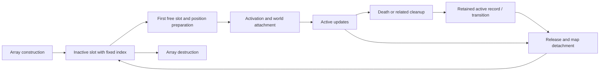

# Original entity lifetimes (No-CD build)

Reviewed 2026-10-04. This maps allocation, activation, cleanup, removal and reuse
in the original PE32 engine, complementing [world tick recovery](world-tick-loop.md).
It is static reverse-engineering evidence, not a native entity implementation or
live validation. Function names below are descriptive labels, not recovered
source symbols.

## Build and reproduction

- Input: `working/game-nocd/Chaos.exe`, preferred image base `0x00400000`.
- SHA-256: `40209ca76705b5db04ea1974543bdec1739c68acdebdbefe2537ed025b8b7168`.
- Evidence: bounded Intel disassembly, direct callers, and read-only Ghidra 12.1.4
  decompilation cross-checked against instructions. Decompiler receiver arguments
  are sometimes missing; follow `ECX` in the assembly.
- High confidence means directly confirmed control flow/stores for this build.
  Semantic names and completeness of reference ownership have lower confidence.
- Addresses are preferred-image VAs. Pool bases and allocation addresses are
  runtime pointers; no cross-launch pointer stability has been established.

Reproduce the instruction evidence without patching or launching the game:

```bash
./tools/original-manifest.sh verify
python3 tools/export-entity-lifetimes.py
./tools/original-manifest.sh verify
```

The exporter rejects other executable hashes, verifies instruction anchors,
rechecks its input hash, and creates a fresh `working/decompiled/entity-lifetimes-*`
directory with 32 assembly ranges, direct call/jump contexts and artifact hashes.
References are textual direct references, not a complete indirect-call graph;
inline jump-table data can appear as instructions. Nothing in `original/` is edited.

## Pool and identity inventory

| Family | Manager VA / pool pointer field | Capacity | Tick/high-water bound | Record stride | Identity / eligibility |
| --- | --- | --- | --- | --- | --- |
| Creatures, including wizard-like records | `0x006def58`, manager `+0` | `+4` / `0x006def5c` | `+0x228` / `0x006df180` | `0xe4b` | DWORD `+0` slot index; DWORD `+4` active |
| Missiles/effects (mixed types) | `0x00689498`, manager `+0` | `+4` / `0x0068949c` | `+0x444` / `0x006898dc` | `0x22e` | DWORD `+0` slot index; DWORD `+4` active; `+0x20e` also gates admission |
| Map-linked third family; complete type taxonomy unresolved | `0x006b1248`, manager `+0` | `+4` / `0x006b124c` | `+0x18` / `0x006b1260` | `0x7e` | DWORD `+0` slot index; DWORD `+4` active |

The bounds are **highest active slot plus one**, not population counts: activation
raises the bound to `max(bound, index + 1)`; release of the last occupied slot
scans backward over holes. Interior release does not compact records or reduce
the bound. These operations are confirmed for all three families.

An index resolves as `pool + index * stride`, often checked against capacity,
not the active bound. No generation comparison appears in the reviewed resolvers.
An address or index therefore identifies storage, not a unique creature lifetime.
The first free creature slot can be returned repeatedly until activation; the
allocator does not reserve it. Nested creation and threading semantics remain
unverified. Native handles will need an intentional lifetime policy and boundary
translation; adding generations alone does not reproduce original cleanup.

## Creature lifetime



Edges describe observed paths, not a complete death-state machine. In particular,
cleanup, release, slot reset and C++ destruction are different operations.

| Operation | Function VA | Confirmed behavior |
| --- | --- | --- |
| Prepare pool | `0x00473100` | If manager pool is null, allocate `capacity * 0xe4b + 4`, store array count in the prefix, construct every record, publish pool after prefix; then reset slots and scheduler/iterator fields |
| Construct storage | `0x00505db0` | Initialize embedded structures and owned pointer fields; supplied as the array constructor at `0x00473145..0x0047315e` |
| Reset all slots | `0x0052a5c0` | Call slot reset with each index across **capacity**, then unlink/free manager list nodes at `+0x94`, count `+0x98` |
| Reset one slot | `0x005060a0` | Release previous `+0x708` callback object and `+0x8f9` list, clear exactly `0xe4b` bytes, create replacement callback/list infrastructure, install index at `+0`, leave `+4 == 0` |
| Find free slot | `0x0052a640` | Scan from index zero for `+4 == 0`; return pointer or null on exhaustion; no allocation, compaction or active-flag write |
| Prepare position | `0x005070e0` | Install tile coordinates `+8/+0xc/+0x10` and fixed-point presentation coordinates; uses map/type data |
| Activate | `0x00506290` | Set owner/army candidate `+0x174`, type `+0xa8`, borrowed type-record pointer `+0xac`; attach map occupancy through `0x00509230`; set `+4 = 1` at `0x0050639e`, grow bound; reset baseline via `0x005065e0` and register further state |
| Death/related transition candidate | `0x0050cdc0` | Consult scenario/session logic, call cleanup with argument zero, clear `+0x104`; later select state `0x10` or `5` via `0x0050aa30`, with special branches; does not directly clear `+4` |
| Cleanup | `0x0051f5e0` | Clear combat/interaction and attached-effect state, notify peers, stop sound handles; does **not** release the slot or clear `+4` |
| Release | `0x00506d30` | Invalidate peers, detach map occupancy, clear `+4` at `0x00506e03`, shrink trailing bound, perform special-type/session cleanup and release notifications; does **not** free record storage |
| Destruct storage | `0x00505f70` | Delete callback object, destroy/free list infrastructure and embedded members; separate from normal slot release |
| Array delete helper | `0x00416530` | Flag-controlled array destruction uses prefix count, stride and destructor, then optionally frees allocation starting at pool minus four |

High confidence for these stores and calls. `+0x174` is an owner/army candidate
supported by deployment's army-index diagnostics. Death naming is medium
confidence: the full damage-to-death-to-corpse state graph and all special cases
are not yet recovered. The array-delete helper exists, but its complete manager
shutdown ownership path has not been connected; do not assume world exit frees
the creature array. Pool preparation itself does not explicitly zero `+0x228`;
the enclosing lifecycle must establish that bound.

### Creation paths

Confirmed direct free-slot calls: `0x0048f729`, `0x004f0428`, `0x005676e3`,
`0x0059279e`. All lead to `0x00506290` activation, but admission differs:

- `0x004f0320`: map deployment; placement checks precede activation, with explicit
  creature-animation loading and army-index diagnostics.
- `0x0048f690`: effect-driven creation; keeps a raw creature pointer at secondary
  record `+0x198`, prepares position, selects owner and activates; later stores
  creature index at secondary `+0x48`. Exact summoning/type taxonomy is unresolved.
- `0x005676e3` within `0x00566e60`: scenario/session creation path; activation
  call at `0x00567816`. Full scenario conditions remain outside this map.
- `0x00592780`: another creation caller; activation at `0x00592b4d`. Its full
  gameplay role remains unresolved.

Activation can also be called on an existing pointer: do not equate every call
with a newly allocated slot. Animation/type assets are shared external data;
activation and special release branches call other managers, so entity ownership
cannot be reduced to a pool array.

### Cleanup, expiry and invalidation order

`0x0051f5e0` visits active secondary records with `+0x48 == creature index` and
`+0x4c == 0x32`, releasing those via `0x004943f0`. It also handles selected
attached secondary pointers and stops nonzero voice handles at creature
`+0x120`, `+0x794`, `+0x805` through `0x004de090(0, 1)`. These sound fields are
handles; callback `+0x708` and list `+0x8f9` are owned allocations. In slot reset,
the callback's `+0xc` points back to the creature and `+4` receives `0x0051e890`.
This gives native audio/effect migration concrete cleanup dependencies.

`0x00508b00(other, removed_index)` invalidates `+0x906` unconditionally on match.
Matching `+0x64c` and `+0x6a8` references are cleared only when the other record's
`+0xe4 != 0`; selected states also adjust the removed target's `+0x668` counter
and change the observer's state. Both cleanup and release call this for active
peers. This is evidence for selected reference repair, **not** proof that all
raw pointers and index holders are invalidated. For example, target resolver
`0x0052a310` checks capacity but does not check the resolved record's active flag.

Release detaches current map coordinates through `0x005093e0` before clearing
the active flag; when `+0x618 != 0`, it also detaches a saved position from the
`+0x97f` array selected by `+0x977`. The map uses 12-byte cells, creature index
WORD at cell `+4`, and `0xffff` as empty. Type-dependent footprints affect
additional cells; preserve the recovered routine rather than inventing one-cell
occupancy removal.

The maintenance pass contains a bounded expiry path: positive DWORD `+0xcff`
decreases by five, clamped to zero. Below 31, if `+0x750 == 0`, it first calls
`0x0049d070(index)` and sets that flag; **otherwise**, if the countdown is zero,
it calls cleanup at `0x0050a20b`, then release at `0x0050a212` and returns.
The first branch can delay release until a later update. The countdown's units
and gameplay meaning are not confirmed; this is not evidence of seconds or a
universal corpse duration.

Release also has a conditional cascade: when `0x00411e50(type_record)` succeeds
and creature `+0x7c == 0`, it performs owner/session and shared type-resource
cleanup, then releases other active records of the same `+0xa8` type and invokes
their cleanup. The branch explicitly treats types `0`, `0x18`, `0x19`, `0x1a`
specially elsewhere. Wizard/leader semantics are inferred, not a complete taxonomy.
There is no general idempotence guard at creature release entry; don't call it
twice and assume every dependent action is harmless.

## Secondary missiles and effects

High confidence for pool mechanics, medium for the complete family name. Original
diagnostics label types with `DIRECTMISSILE`; creature spawning and attachment
paths show the pool also contains effects and other transient records.

- `0x0049cc80` resets indices, manager backpointer at record `+0x24`, active flags
  and admission field `+0x20e` across capacity, clears high-water bound and manager
  lists. World setup calls it at `0x00470b25`. This reset does not individually
  run release for old records; teardown ordering matters.
- `0x0049cec0` scans slots `0..124` for **both** `+4 == 0` and `+0x20e == 0`.
  `0x0049cdb0` scans from slot 125 up to capacity with the same gates. If full,
  it walks selected existing types `0x55`, `0x0e`, `0x1a` and requests transitions
  or release, then returns null; it does not immediately return a reclaimed slot.
- `0x00493f20(record, type, descriptor)` accepts type `0..0x58`, copies 63 DWORDs
  into `+0x2c`, computes map links, writes `+4 = 1` at `0x0049433a`, grows the bound.
- Map cell WORD `+2` is a secondary slot index, linked through record WORD
  `+0x1a0`, with `0xffff` sentinel. `0x004943f0` invokes unlink routine
  `0x00488330` before clearing active, shrinks bound, clears `+0x20e` and associated
  fields, resets embedded presentation data, and handles `+0x19c` resource state.
- For types `0x2b` or `0x46` with `+0x5c == 2`, release follows another slot index
  at `+0x60` and repeats. Linked removal is part of lifetime behavior.

Neither release nor admission frees record storage. Allocation of the backing
array, all writes to the reservation field, reserved-slot fallback policies,
descriptor taxonomy and complete cross-pool reference repair remain unresolved.

## Third map-linked pool and world teardown

`0x00543970` activates a `0x7e` record, installs type at `+0x2a`, appends it to
map cell WORD `+6` through record WORD `+0x28`, sets `+4`, and grows
`0x006b1260` at `0x00543a96`. Certain types create secondary type `0x3c` records.
`0x00543c60` detaches via `0x00543de0`, clears active, shrinks bound, and for
type values above `0x60` walks the cell's secondary list, releasing type `0x3c`.
High confidence for these mechanics; the full gameplay taxonomy, creation
admission and backing-array allocation are open. Its manager updates at
`0x0046b865` via `0x00544d10` during the normal world pass.

The entity portion of world teardown `0x0046ab30` has this observable order:

1. Manager-level creature presentation/audio cleanup `0x0052baf0` at `0x0046ab87`
   across capacity, clearing selected resource fields even outside active slots.
2. Release active secondary slots across capacity (`0x0046aba4`).
3. Release active creatures through manager iterator `0x0052a670`
   (`0x0046ac00`); the iterator tolerates holes without moving records.
4. Release active third-family slots across capacity (`0x0046ac2b`).

The earlier secondary/presentation portion has a session-byte guard; the creature
and third-family loops follow outside it. Full teardown continues into other
managers and map allocations. Normal teardown demonstrates logical removal;
it is not evidence that all entity backing arrays are freed.

## Coverage and next validation boundary

This closes the static outline for the three pooled world families: their identity,
activation, release, bound maintenance, selected dependencies and teardown order.
It does **not** close every entity lifetime in gameplay. Outstanding work:

| Gap | Required evidence before gameplay can leave the executable |
| --- | --- |
| Death/corpse/resurrection and special-type transitions | Trace all state-setting callers and resource-retention decisions; map damage ingress separately |
| Backing storage and load/reset ownership | Connect manager construction/destruction, secondary/third allocations, save/load restoration and repeated session resets |
| Complete reference ownership | Audit scenario, spell, selection, callback, raw pointer and index holders, especially across slot reuse and cascades |
| Admission and exhaustion | Observe creature exhaustion, first-125 secondary policy, reservation changes and delayed reclamation |
| Live ordering | Bounded traces of spawn, death, despawn, attached-effect release, tail/interior slot reuse, cascade and world exit with tick/thread IDs |
| Other entity families | Inventory scenario/script records, queued spells/orders, map objects and persistent state; these three pools are not the whole world schema |

A future observer should record pool family, slot, active-before/after, bound,
call site, tick candidate, thread ID and an observer-assigned lifetime sequence.
It must distinguish cleanup from release and avoid treating a reused pointer as
the previous entity. No observer, game launch, binary patch or replacement was
performed for this map. See [coverage ledger](coverage-ledger.md), GP10.
