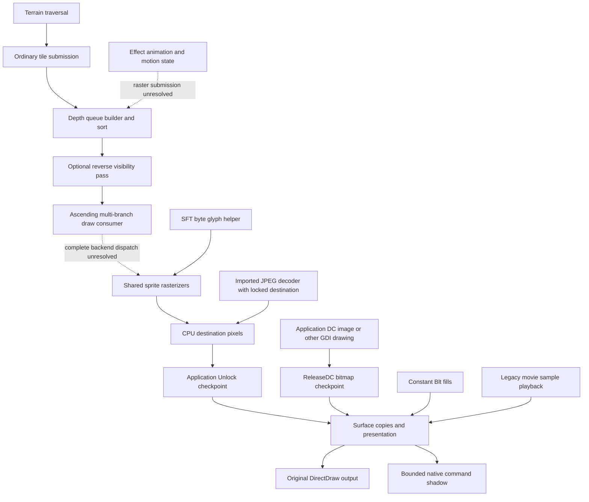

# Rendering inventory, callers and unsupported branches

The [complete live drawing replacement plan](../../docs/live-drawing-replacement.md)
owns cross-subsystem scope, implementation order and launcher readiness. This
inventory owns drawing-route classifications and their build-specific evidence.

## Reconciled support accounting — 2026-10-10

The [rendering coverage crosswalk](rendering-coverage.md) now connects all nine
inventoried families and twelve required surface categories to reviewed scoped
code and selected independent comparisons. It separately records newer complete
startup World raster-body bypass evidence: ten of thirteen admitted entries in
two queues1..16 executions, and nine in a later identity-cache execution. These
are per-experiment whitelist counts, not an exhaustive binary API percentage.
Original terrain traversal, outside-World UI/GDI producers and full-session
replacement remain separate. The static inventory and historical findings below
retain their recorded dates, inputs and limitations.

## Current rendering inventory — 2026-10-06

Scope: No-CD SHA-256
`40209ca76705b5db04ea1974543bdec1739c68acdebdbefe2537ed025b8b7168`,
preferred image base `0x00400000`, existing isolated original comparisons,
recorded startup/battle observations and current adapter admission code. No new
live game run or original-routine comparison was performed for this inventory.
Static confidence is high for the listed local instructions; semantic caller
classification is bounded by the linked research. Unknown callers remain unknown.
The clean executable has different addresses and is not covered by this map.

“Active” has three distinct meanings here: **live observed** in a retained game
run; **executed offline** in a private original-code fixture; or **static only**,
meaning a reachable drawing path without a runtime hit established here. Counts
of direct call sites are never runtime frequencies. Copies/fills/locks/DC are
transport or raster operations; terrain/sprites/effects/UI are producers that
can share those operations. They are not disjoint percentages of rendering.

| Class / behavior ID | Original route and callers | Activity and native boundary |
| --- | --- | --- |
| Copies — `RI.copies` | Whole opaque `0x58bf40`, keyed `0x58c140`; rectangle wrappers `0x58c360`, `0x58c4a0`, `0x58c8a0`, `0x58ca90`, `0x58cbc0`. Surface2 Blt `+0x14` / BltFast `+0x1c`. Caller ownership/site lists are in the static report linked below. | Live observed: return sites `0x58c05d`, `0x58c488`, `0x58c5be`, `0x58c9af`, `0x58cbb2` in the [busy-surface investigation](render-startup-black-screen.md). They are post-call return PCs, not wrapper entries. Current owned adapter supports equal-format, equal-size opaque/exact-source-key copies, including indexed indices. |
| Fills — `RI.fills` | `0x58bac0` builds a 100-byte effects structure, truncates colour to 16 bits, calls Blt at `0x58bb0a` with NULL source and flags `0x01000400`. `0x58bc10` is another fill/restore/retry window. | [Live startup fill observation](opengl-owned-session-fills.md), with synthetic indexed8/RGB16/24/32 tests. Native route is rectangle UPDATE of constant pixels, not a recovered GPU-clear implementation. |
| Locked pixel writes — `RI.locked-writes` | `0x58b660` returns the pixel pointer and stores pitch. Selected CPU WORD copy window `0x58d3b0..0x58d4a7` locks twice (`0x58d419`, `0x58d429`), reads WORDs at `0x58d45d`, writes at `0x58d464`, then unlocks twice. `0x58d320` passes locked pixels/width/pitch/height to imported JPEG decoder at `0x58d34b`. | Live Lock/Unlock capture and [packed UPDATE routing](opengl-owned-session-unlock-packed.md). The WORD-copy window lacks a discovered census function: retained as an unassigned window, not a newly asserted boundary. Producer identity of other lock callers is unresolved. |
| GDI / text — `RI.gdi-text` | Surface wrappers `0x58d1a0`, `0x58d240`, `0x58d280`, `0x58d370` acquire DC at `+0x44`, call image helper `0x486a80`, release at `+0x68`. Separate SFT byte draw `0x4a59e0` calls shared sprite drawing `0x581ec0`; initializer `0x5575b0` loads four font roles. | [Live DC checkpoint](opengl-owned-session-dc.md) confirms bitmap handoff, not a font or GDI-operation trace. SFT helper semantics are [static findings](sft-font-loading.md). Native Qt SFT outlines use their own layout/antialiasing policy. Do not label every DC as text. |
| Terrain — `RI.terrain` | Four traversal entries `0x4f83f0`, `0x4fbe00`, `0x4fc3f0`, `0x4fc930` feed ordinary producer `0x4f8960`; it produces queue records through `0x4ffd30`. Sort `0x4fff60`, optional visibility `0x5015f0`, ascending consumer `0x5002a0` follow. | Executed offline for bounded ordinary terrain submission/traversal/queue; native authored/generated previews. [Submission](terrain-submission.md) covers ordinary body/first/second roles; [rotations](terrain-traversal-rotations.md) has its separate evidence. No live terrain draw coverage claimed. |
| Sprites — `RI.sprites` | Shared dispatch `0x581ec0`; frame member `+0x1c == -1` selects direct-word drawing at dispatch site `0x57e8e8`. Non-MMX word backend `0x597086` is selected at `0x484561`; selected indexed drawing uses palette-chain lookup `0x57e1db..0x57e20c`. Queue consumer `0x5002a0` has multiple draw branches. | [Original isolated comparison](sprite-binary-comparison.md): 91 selected installed frames, transparency/origins/direct words/fixture indexed palette. Native RGB565 + coverage-mask GPU drawing matches those samples. Consumer itself is statically traced, not executed in the queue fixture. |
| Effects — `RI.effects` | Creator `0x493f20` → type/animation setup `0x494ab0`; selector `0x489200`, controller bind `0x464ca0`/`0x464cb0`/`0x464ec0`; trajectory `0x4df500`, movement `0x4883f0`; static light admission `0x49cf60` and light-field refresh `0x4f27a0`. | Executed offline for individually registered effect state/animation/lighting contracts. [Animation binding](effect-animation-binding.md) describes forward setup. This is upstream state, not proof of effect raster submission. Effects3 frame samples establish selected sprite drawing only. Full effect-to-queue-to-pixel caller chain remains open. |
| UI — `RI.ui` | UI assets include direct-word Buttons/timer SPR frames and indexed fonts. Shared copies, CPU sprite rasterization and DC image routes can compose the menu. Startup caller `0x4e986a` creates surfaces before movie calls. | Live menus and bounded startup native PRESENTs are observed. [Native menu images](menu-image-integration.md), [SPR controls](menu-sprite-integration.md), [fonts](menu-font-integration.md) are independent Qt policies. Complete original widget/HUD caller attribution and paired menu/gameplay pixels remain pending. |
| Movies — `RI.movies` | Startup `0x4e992b`/`0x4e996c` → wrapper `0x469a00` → stream setup `0x4696e0` / sample playback `0x469830` → DirectDraw blit. Optional native hook sends supported requests to Qt QVideoSink. | [Static original route, synthetic hook and installed Intro0 decode probe](qt-native-media.md). Full live playback/return to map remains unverified. Only control byte zero is admitted natively; other control values fall back. |

### Caller graph and evidence

Reproduce the static caller inventory with:

```sh
./tools/original-manifest.sh verify
python3 tools/export-render-support.py
./tools/original-manifest.sh verify
```

The exporter hash-checks the working executable before and after disassembly.
It now exports the additional fill, rectangle-copy, DC, CPU-write, shared sprite,
queue-consumer, terrain and movie windows. Each window includes **all direct
call sites** found in objdump output with context and discovered owner entries
from the pinned Ghidra census, plus its own indirect call sites. Owner lists can
be empty; a census gap is not silently assigned to the nearest function. Window
ends are selection limits, not a claim of complete function recovery.

Selected direct-site counts: 69 calls to the lock wrapper; 70 opaque and
17 keyed whole-copy calls; 19 and 66 calls to the two fill windows; 69 total
calls to the five selected rectangle-copy wrappers; 41 total calls to the four
DC image wrappers; 50 locked-JPEG calls; eight ordinary terrain submissions
(two sites in each traversal); two queue-consumer calls; four shared glyph
sprite calls; three movie-wrapper calls. The report retains caller lists even
when their discovered owner is absent. Zero direct calls to the WORD-copy
window do not establish inactivity: its entry is not a discovered function and
indirect invocation is unresolved.

The retained [static report](render-path-inventory-static-final.json) embeds caller
contexts, outgoing direct calls, indirect calls and computed jumps, input/source
hashes and artifact hashes. The first [call-only export](render-path-inventory-static.json)
is preserved separately, along with the [initial outgoing-edge export](render-path-inventory-static-full.json).
Their direct caller counts remain useful, but their computed-flow lists include
some direct operands because of whitespace backtracking in the first parser.
They are superseded for computed-flow classification by the final static report;
source fingerprints remain historical. The final exporter explicitly requires
an indirect operand after whitespace, and its computed jump sites are checked
against the selected assembly.
Its assembly artifacts remain under the recorded working export directory.
The caller map is build-specific; COM, imported DLL, backend pointers and
other computed calls remain unresolved even when surrounding code is understood.
The complete binary census is preserved unchanged. Selected instructions do not
recover a complete rasterizer dispatch table or justify classifying unknown
functions as unused. The inventory registers no function-wide exclusion.

The scoped [direct-word MVP](native-word-sprite-mvp.md) now owns `RS.word-raster`,
`RS.word-route` and `NR.word-admission`. Its two backend entry hooks cover only
fully in-bounds direct-word SPR draws. The first call-site-only live experiment
saw no calls; its first World queue contained only indexed frames. Backend-entry
shadow/takeover tests subsequently exercised direct-colour UI raster work through
battle startup. This does not classify indexed World dispatch, entire consumer
branches or complete scenes. Other raster routes and computed flows remain open.

The [complete World canvas increment](native-world-frame-rendering.md) adds
`RS.world-frame`, `RS.world-composition` and `NR.world-admission`. Four bounded
800x600 consumer outputs now have complete native pixel comparisons from owned
effective requests and pinned native assets, including actual colour tables,
horizontal/vertical clipping, three blends, displacement and projected shadows.
Their 1,920,000 pixels match separate live output and private original raster
execution. Original consumer/raster work remains active during capture; later
HUD/window output, complete consumer side effects and continuous takeover remain
open. Generic/terrain selected backends internally clip horizontally; black and
selected distortion entries instead return1 without pixels at those bounds.

The queue consumer calls a larger raster family directly: `0x57dc60`,
`0x57de00`, `0x57e540`, `0x57e8e0`, `0x57f5f0`, `0x57ec90`, `0x57f0f0`,
`0x57fe10`, `0x580a90`, `0x580260`, `0x581200`, `0x5806f0`, plus indirect
slots such as `0x689b7c`, `0x6c4e3c`, `0x689b78` and `0x6903dc`.
These are confirmed call targets/sites, not names for recovered algorithms.
The consumer is not a simple call-through to `0x581ec0`; the latter is the
separately documented shared SFT glyph route. Three observed computed jumps
remain explicitly incomplete dispatch records:

| Jump site | Table address | Scope / unresolved branch |
| --- | --- | --- |
| `0x5003fc` | `0x501184` | Selected kinds 0/31,1,2,3,4,5,6,22 now link to bounded raster contracts; kind33 terrain is handled before the table. Other values/defaults and complete consumer semantics remain open. |
| `0x50093d` | `0x501210` | Alternate consumer path; do not assume identical behavior to the first table. |
| `0x500d69` | `0x50129c` | Later consumer path; remaining admission and backend semantics unclassified. |

The first table's selected links are described in the World canvas research;
the other two tables remain unclassified. Existing binary candidate flows remain preserved.
Direct per-pixel drawing can bypass DirectDraw method logging until Unlock.
The selected JPEG import and unassigned WORD-copy window are concrete examples
of why a Blt-only inventory would omit original drawing work.

Producer map (confirmed links only; dotted link is an open semantic mapping):



### Unsupported and unclassified branches

“Unsupported” below means refusal by a particular capture/native adapter, or
omission from a bounded reconstruction. The original may still implement it;
its call is forwarded. Different observer/history/owned modes have different
admission limits. Do not apply the initial 256x256 sample limit to every adapter.

| Path | Explicit branch / remaining boundary | Consequence / owner |
| --- | --- | --- |
| Copy adapter | Self-copy; stretching; format conversion; active/unknown Blt clipper; flags beyond WAIT and exact source key; ranged/unobserved source key; destination keys, ROP, DDFX, blending or rotation. Partial/keyed writes cannot seed an unknown destination. | `runtime/render/lock_surfaces.h`: named `blit_reject_*`, `blit_source_key_unobserved`, `blit_incomplete_initialization`; invalidate/refuse native tracking while original drawing continues. |
| Fill adapter | Source rectangle present; unknown/attached clipper; extra flags; malformed effects; colour wider than destination; out-of-bounds rectangle; initial partial fill. | `game_fill_before`: reject unsupported input or incomplete base. Original wrapper's restore/retry branches are not independently equivalent native restoration. |
| Lock writes | Missing base for rectangular update; unsupported descriptor/format/pitch/bounds; alias ambiguity; unmatched Unlock; failed call; cross-thread/epoch/generation change; borrowed DC overlap. | `lock_lifecycle.h`, `lock_updates.h`, `lock_aliases.h`: drop speculative bytes or invalidate ownership. CPU algorithm behind most lock callers is still unclassified. |
| GDI / text | Indexed DC, odd native row bytes, incompatible bitmap/masks; duplicate/unreleased context, thread/bitmap changes, failed flush/read or successful release without valid checkpoint. | `lock_dc.h`: RGB16/24/32 checkpoint only. Individual GDI commands and original text line layout, encoding, palette and glyph raster equivalence remain unrecovered. |
| Terrain | Object references, creature-presence, water/overlays, picking mutations, full map post-load normalization, full camera initialization, special terrain and original complete-world draw. | Ordinary tile fixture deliberately disables entity/overlay branches. Kind 31 versus 33 visibility and missing child frames are covered only by their documented selected scopes. |
| Sprite raster | Original clipping variants, MMX/alternate backend choices, RGB555 live transitions, palette-chain/shading generation, auxiliary planes and effects, all queue-consumer draw kinds/default paths. | Shared consumer/dispatch table is incomplete. Native sprite clipping is a separate policy; an unshaded fixture palette does not validate the palette builder. |
| Effect pixels | Complete admission, ANI/action scheduling, reverse controllers, attachments, shading/lighting variants, effect draw-kind selection and raster dispatch. | State/lighting/animation evidence cannot promote full visual coverage. Kind-specific branches and unresolved indirect draw flows stay open. |
| UI | In-game HUD/minimap/tooltips and original menu control-to-draw caller mapping; complete original text composition and paired screenshots. | Native QWidget menus and image/font integration do not establish original UI draw parity. Buttons/timer frame comparisons do not cover their callers. |
| Movies | Nonzero control byte; original setup/sample error branches; exact original x/y placement, full audio/video lifecycle and return to gameplay. | `media_bridge.h`: unsupported/pre-accept failure retains original wrapper; post-accept failure cancels without duplicate playback. Qt aspect-preserving viewport is an intentional policy. |
| Presentation | Longer/stereo/field Flip chains, unknown attached-buffer ownership/palettes; resource/record/byte/operation exhaustion, pending DC/locks, malformed sequence or transport cancellation. | Verified double-buffer routing only. Live v2 decoder streaming does **not** remove PE32 owned archive/sample limits; see [current streaming scope](opengl-command-streaming-lifecycle.md). |

### Current observation boundary

The latest [streaming startup record](opengl-command-streaming-live.json) retains
three native PRESENTs while original drawing continues. They are identical early
startup frames, not gameplay. Earlier [first startup presentation](opengl-owned-session-startup.md)
passed owned CPU CHECK snapshots; those are not an independent driver-pixel
oracle. Historical battle observations establish activity and failure diagnostics,
not native complete battle output. There is no renderer replacement claim.

Next evidence needed to call this a runtime-frequency inventory: bounded event
traces tagged with startup/menu/map/battle/HUD/movie scenarios, caller return PCs
normalized against the executable, per-operation success/refusal counts, and
original-driver pixel comparisons independent of hook-owned snapshots. Until
then, preserve static caller counts, live hits and fixture coverage separately.


## Historical first drawing milestone

Recorded 2026-10-03. This is the next step after
[Qt/OpenGL frame presentation](opengl-presentation.md): identify a drawing
operation, retain its inputs and original output, and compare an independent
reference implementation. The engine still draws through DirectDraw. No game
session was launched during this work.

## Static evidence: high confidence for this executable

Pinned no-CD working executable SHA-256:
`40209ca76705b5db04ea1974543bdec1739c68acdebdbefe2537ed025b8b7168`,
preferred image base `0x00400000`. Reproduce with:

```bash
./tools/export-render-support.py
```

The exporter verifies the hash before creating output, exports selected assembly
windows, finds direct call sites with nearby instructions, and hashes artifacts.
Addresses below refer only to this build. Initial output:
`working/decompiled/render-support-kwx3j0_o/`, including monitor API string bytes.
No function boundaries are inferred from a direct call's
surrounding instructions.

| Wrapper/site | Confirmed observation |
|---|---|
| `0x58a9b0`, `0x58aa90` | Fullscreen/windowed DirectDraw setup; one direct call site each |
| `0x58ad90` | Surface creation and surface-interface query; 57 direct call sites |
| `0x58b660` | Surface lock wrapper; 69 direct call sites |
| `0x58b69d`, `0x58b735` | Surface Lock at vtable byte offset `+0x64`, including retry |
| `0x58b7f4` | Reads the locked pixel pointer from `0x6f6904` for return |
| `0x58b806` | Conditional Unlock at `+0x80` before returning that pointer |
| `0x58bf40` | Whole-surface opaque-copy wrapper; 70 direct call sites |
| `0x58c03a`, `0x58c05a` | Blt `+0x14` / BltFast `+0x1c`, with WAIT flags |
| `0x58c140` | Whole-surface source-keyed copy wrapper; 17 direct call sites |
| `0x58c239`, `0x58c252` | Blt with KEYSRC, without/with WAIT |
| `0x58c276` | BltFast with SRCCOLORKEY, optional WAIT |

The surface wrapper accesses Surface2 at object `+0x08`, width/height at
`+0x10/+0x14`, and stores pitch at `+0x18`. Its 108-byte descriptor is at
`0x6f68e0`; pitch is `0x6f68f0` and pixel storage pointer `0x6f6904`.
Restoration code sets a source color key from object WORD `+0x2c` using
SetColorKey `+0x74` and flag 8. These fields are confirmed for the inspected
wrappers, not a complete object layout.

`0x58b270` loads USER32 monitor functions, including MonitorFromWindow,
GetMonitorInfoA and GetSystemMetrics. Strings reside in `0x5f19d8–0x5f1a63`.
Its indirect calls must not be mistaken for dynamically selected rasterizers.

The numerous lock callers and returned pixel pointer establish a CPU-visible
surface path alongside Blt/BltFast composition. **Inference:** replacing only
DirectDraw copies is unlikely to replace all rendering. Actual pixel-writing
loops, sprite asset formats, terrain drawing and gameplay frequency remain
unclassified. Static caller counts are not runtime draw counts.

## Implemented capture and replay

`runtime/render/` remains new instrumentation, separate from reconstructed
engine algorithms. Its PE32 bridge now forwards BltFast as well as Blt/Flip
and captures successful primary-surface presentation through all three.

Opt-in draw capture logs the first 2048 observed application calls to Blt,
BltFast, Flip, Lock, Unlock and CreateSurface. Each includes a caller return
address for correlation with static evidence. Observer locks are excluded.
Pointer tokens identify interfaces only within a run; allocator reuse and
interface aliases prevent treating them as persistent surface IDs.

The bridge additionally tries at most eight eligible small blits and writes
at most one capture file. It records full source and destination-before pixels,
releases its locks, forwards the original draw unchanged, and reads destination
pixels afterward. Supported operations are equal-format, unscaled, in-bounds
opaque or source-keyed copies without a clipper, effects or self-copy. Source
size is bounded to 256x256; destination to 2048x2048. Readback uses nonblocking,
read-only locks; failed snapshots skip evidence without changing API results.
Original HRESULTs and last-error state are preserved. Details and exact binary
layout are in [the format specification](../formats/render-draw-capture.md).

The native-pixel CPU reference in `tools/replay-render-capture.py` copies the
source rectangle, skipping pixels equal to an enabled source key. Color-space
key ranges are deferred; inspected wrappers set equal low/high values. It compares
the whole resulting destination against captured output, writes mismatch
coordinates and native values, and produces source/before/captured/replayed PPMs.
This establishes a small drawing contract for a future OpenGL implementation;
it does not replace game drawing yet.

## Prepared live procedure

```bash
./tools/run-qt-shell.sh --capture-draws
```

The shell opens without launching the game. Click **Launch game** when ready;
the launch log prints the new `draw-capture` directory. Exit the game, then run:

```bash
./tools/replay-render-capture.py working/experiments/opengl-render/run-XXXX/draw-capture
```

The first eligible operation may be a menu bitmap; it is not automatically a
creature sprite. No file means no completed eligible sample (unsupported path,
busy surfaces, exhausted attempts or failed file creation); the event inventory
can still narrow the active path. Capturing perturbs rendering and disk traffic;
these are correctness samples, not benchmarks. Concurrent surface modifications
are not globally frozen and may cause an honest mismatch.

Staging-only validation created
`working/experiments/opengl-render/run-1wpu8mon/` with a hash-checked PE32 DLL,
patched disposable executable and empty capture directory. The game was not
started. The shell command above creates a fresh experiment when launched.

Use the PPMs and caller addresses to classify the sample. The same small copy
contract is now implemented in the [native OpenGL renderer](opengl-blit-replay.md).
Run replay with `--backend opengl --headless` to compare the shader result
against both this reference and captured output. Selected CPU pixel-writing
callers and sprite decoding remain later work.
Input forwarding, full surface lifetime tracking, palette updates, clipping,
effects, animation and complete in-game equivalence remain separate work.

## Validation and confidence

`python3 tests/test-render-capture.py`: seven host tests cover all four native
pixel sizes, opaque/exact-key copies through both operation formats, subrect
strides, duplicate palette colors, full-destination mismatch reporting, preview
output and malformed/truncated evidence rejection.

`./tools/test-render-bridge.py`: isolated synthetic Wine run
`working/tests/render/run-mmyp99hs/` validates actual x86 hooks with opaque Blt
and source-keyed BltFast, independently expected pixels, negative source pitch,
padded destination rows, old Surface2 unlock ABI, original error/result values,
unsupported-flag forwarding, post-call busy-surface rejection and retry,
one-capture limit and exclusion of observer locks
from events. Replay matched both captures exactly. The existing mapped-frame
producer-to-Qt/OpenGL readback also passed. These are fake COM surfaces; actual
game/driver compatibility still requires live evidence.

All six existing Qt CTests pass. Production PE32 bridge build, staging hashes,
export artifact hashes and rejection of an unsupported executable also pass.

Primary API references:
[Blt](https://learn.microsoft.com/en-us/windows/win32/api/ddraw/nf-ddraw-idirectdrawsurface7-blt),
[BltFast](https://learn.microsoft.com/en-us/windows/win32/api/ddraw/nf-ddraw-idirectdrawsurface7-bltfast),
[GetColorKey](https://learn.microsoft.com/en-us/windows/win32/api/ddraw/nf-ddraw-idirectdrawsurface7-getcolorkey).

### Subsequent route observation — 2026-10-06

The [campaign/movie-enabled route record](opengl-render-routes.md) extends the
startup boundary above without changing its historical evidence. Five independent
X11/native stable menu regions match within one channel value, including a title
after failed-reader recovery. Original campaign Enter reaches three World ticks,
but native publication exceeds the 32-surface budget at the 33rd observed resource;
complete recovery refuses and fresh observations invalidate untracked copies. This
is not complete terrain/sprite/effect/HUD output or a recovered original caller map.
Movie-enabled startup reaches Main, with no movie sample return PCs in the bounded
draw archive; actual playback and return semantics remain unverified. Original
drawing stays active; full visual equivalence and replacement are still open.
